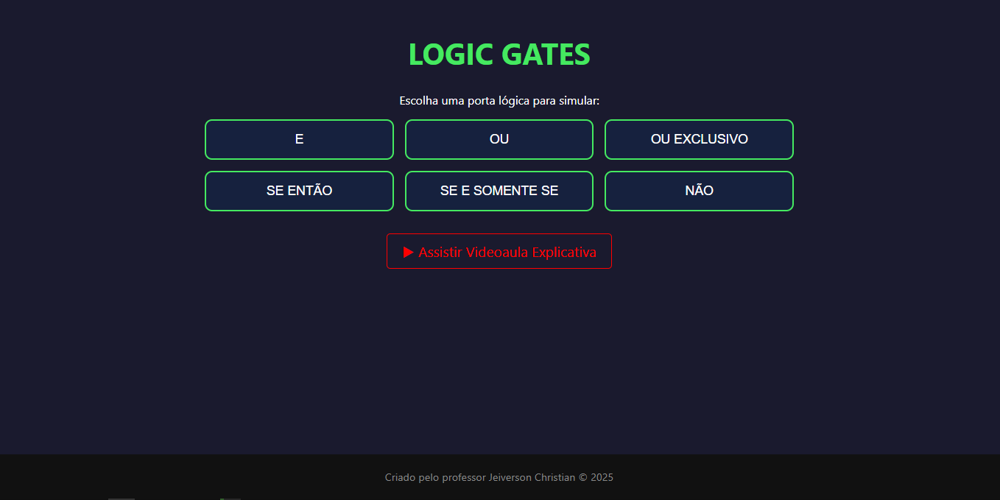

<h1 align="center">
   
  ⚡ Logic Gates Simulator ⚡
   
</h1>

<h4 align="center">Um simulador interativo e visual para desmistificar o funcionamento das Portas Lógicas.</h4>

  <a href="#-sobre">Sobre</a> •
  <a href="#-funcionalidades">Funcionalidades</a> •
  <a href="#-tecnologias">Tecnologias</a> •
  <a href="#-autor">Autor</a>

  

## 💡 Sobre

O **Logic Gates** é uma ferramenta educacional desenvolvida para tornar o aprendizado de Raciocínio Lógico Matemático e Computacional mais intuitivo e divertido.

Ao invés de apenas decorar tabelas-verdade, o aluno pode **interagir** com os interruptores e ver, em tempo real, como a "energia" flui através dos circuitos até acender (ou apagar) a lâmpada. Ideal para estudantes de tecnologia e preparatórios para concursos públicos.

## 🚀 Funcionalidades

O simulador cobre as principais estruturas lógicas cobradas em provas e utilizadas na computação:

| Porta / Lógica | Símbolo | Descrição Rápida |
| :--- | :---: | :--- |
| **E (AND)** | `∧` | O "Exigente": Precisa de tudo ligado. |
| **OU (OR)** | `∨` | O "Amigo": Basta um ligado para funcionar. |
| **OU EXCLUSIVO (XOR)** | `⊻` | O "Seletivo": Ou um, ou outro, mas não ambos. |
| **CONDICIONAL** | `→` | A "Promessa": Só falha se prometer e não cumprir (V->F). |
| **BICONDICIONAL** | `↔` | O "Espelho": Só acende se as entradas forem iguais. |
| **NÃO (NOT)** | `~` | O "Do Contra": Inverte o sinal (Liga vira Desliga). |

* **Design Responsivo:** Funciona perfeitamente em Computadores e Celulares (ajuste automático de escala).
* **Visual Neon:** Estética moderna para engajar os alunos.
* **Feedback Visual:** Fios brilham quando a corrente passa.

## 🛠 Tecnologias

Este projeto foi construído utilizando tecnologias web puras, garantindo leveza e compatibilidade:

*  **HTML5:** Estrutura semântica.
*  **CSS3:** Estilização, animações neon e responsividade avançada.
*  **JavaScript:** Lógica de programação dos circuitos (SPA).

## 🔗 Como Usar

Não é necessária instalação! O projeto está hospedado no GitHub Pages.

### [👉 Clique aqui para acessar o Simulador Online](https://jeiversonchristian.github.io/Logic-Gates/)

---

## 👨‍🏫 Autor

Feito com 💜 e Lógica por **Prof. Jeiverson Christian**.

---